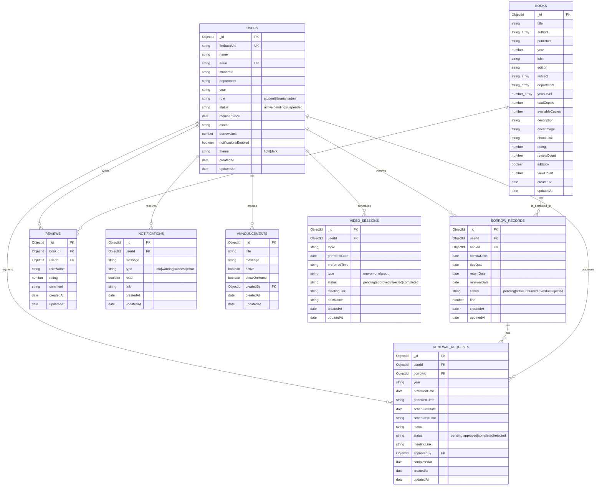

# CUET Bookworld ER Diagram

This diagram is based on the Mongoose schemas in `server/models`. MongoDB stores an implicit `_id` on every document; reference fields are shown as foreign keys even though MongoDB does not enforce relational constraints by default.

## Relationship Notes

- `USERS.firebaseUid` links each MongoDB user profile to the Firebase Auth user.
- `BORROW_RECORDS` is the join collection between `USERS` and `BOOKS` for book borrowing.
- `REVIEWS` is also a join-style collection between `USERS` and `BOOKS`; the route logic allows one review per user per book, but the schema does not define a compound unique index.
- `RENEWAL_REQUESTS.borrowId` points to the borrow record being renewed, while `approvedBy` points to the librarian/admin user who approved the request.
- `BOOKS.rating` and `BOOKS.reviewCount` are denormalized summary fields calculated from `REVIEWS`.
